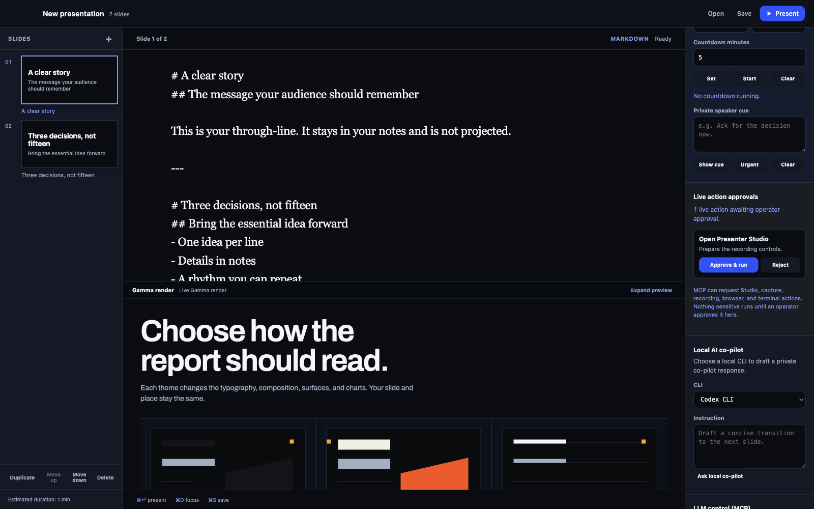

# Gamma Presenter

## The local presentation studio for ideas that refuse to be flat.

Gamma Presenter brings writing, live visuals, presentation control, recording, and carefully bounded AI co-piloting into one macOS workspace. It is built on the open-source Gamma Slides engine, so the Markdown, YAML, and JSON you author remain durable, inspectable source—not a locked canvas.

[Download for Apple silicon](https://github.com/hbfs-cloud/gamma-slides/releases/latest/download/Gamma.Presenter-2.0.0-arm64-mac.zip) · [Run it locally](#run-gamma-presenter-on-macos) · [Read the macOS guide](docs/gamma-presenter-macos.md) · [See the GitHub Pages landing](https://hbfs-cloud.github.io/gamma-slides/) · [Explore the source](https://github.com/hbfs-cloud/gamma-slides)



## Everything needed to run a serious room

| Moment | Gamma Presenter keeps it together |
| --- | --- |
| Write | Markdown for velocity; YAML and JSON for full Gamma layouts, notes, themes, and advanced configuration. |
| Shape | A source-aware slide rail, inspector, direct media import, and an embedded renderer preserve the story and the rich scene behind it. |
| Present | A selected-display Stage, Speaker View, notes, elapsed timers, countdowns, private cues, Dock actions, and a menu-bar controller. |
| Make it live | Images, GIFs, video, audio, ECharts, Archify, D3, Pixi, Three.js, animation, browser demonstrations, and terminal scenes. |
| Co-animate | A loopback-only MCP endpoint and local Codex/Claude CLI workflow. Consequential Stage, recording, capture, browser, terminal, and spoken-note requests require an explicit operator approval. |
| Deliver | Standalone HTML, PDF, PNG, PowerPoint, speaker handouts, and local recording controls—without pretending interactive runtime scenes are editable PowerPoint objects. |

Gamma Presenter is deliberately local-first. Media remains project-local, the presentation MCP service only listens on `127.0.0.1` with an ephemeral bearer token, and capture or terminal access is never ambient. The [macOS guide](docs/gamma-presenter-macos.md) documents the functional coverage, security boundary, known limits, and comparison with iA Presenter, reveal.js, Marp, and Slidev.

## Run Gamma Presenter on macOS

With [Bun](https://bun.com/) installed:

```bash
git clone https://github.com/hbfs-cloud/gamma-slides.git
cd gamma-slides
bun install
bun run desktop
```

Download the current Apple-silicon ZIP from the [GitHub Release](https://github.com/hbfs-cloud/gamma-slides/releases/latest/download/Gamma.Presenter-2.0.0-arm64-mac.zip), or package it locally with `bun run desktop:package`. Releases are built by GitHub Actions from version tags. Apple signing and notarization need the product owner’s Apple Developer credentials, so the package is explicitly unsigned.

## Gamma Slides engine

Gamma Presenter is backed by Gamma Slides: an editorial presentation and local video engine for finance, markets, economics, board reporting, and technical repository reviews. Decks are authored in YAML or JSON, rendered as self-contained interactive HTML, exported as vector-friendly PDF, and recorded or narrated into high-quality local video masters.

Present a Git repository with `$repo-presentation` in the LLM, or `gamma-slides repo-present --repo owner/repo` / `--local /repo`. The workflow produces a complete technical deck, animated Archify diagrams, a local server, and desktop/mobile test evidence. Publish verified bytes with `--publish owner/pages-repo`. [Guide and commands](docs/repository-presentations.md).

### One-line setup for Claude and Codex

With Bun installed, run this once from any directory:

```bash
bun install --global https://github.com/hbfs-cloud/gamma-slides/archive/refs/heads/main.tar.gz && gamma-slides setup
```

It installs the current GitHub version and connects its MCP server to every installed client it finds: Claude Code and/or Codex. The registered command uses the stable global installation path, not this clone. Verify it with `/mcp`, `claude mcp get gamma-slides`, or `codex mcp list`.

Then ask the agent in plain language:

> Create a premium 12-slide presentation in French from `brief.md`, validate every slide, deploy it as `fy26-plan`, and return the public URL. Never invent facts.

The agent can inspect the schema and flagship example, choose among the three themes, generate live ECharts, validate the deck, and create or update its stable GitHub Pages URL.

## Deploy and manage presentations

Publishing uses the free GitHub Pages site at [hbfs-cloud.github.io/gamma-slides](https://hbfs-cloud.github.io/gamma-slides/). Run `gh auth login` once before the first write. A deployment usually appears after the GitHub Actions run completes.

These are the five commands to remember:

```bash
# Create a public presentation, or update it later with the same slug
gamma-slides deploy -f deck.yaml --slug fy26-plan

# List every managed presentation and URL
gamma-slides sites

# Download the editable source
gamma-slides pull fy26-plan -o deck.yaml

# Open it
gamma-slides open-site fy26-plan

# Delete it after explicit confirmation
gamma-slides delete-site fy26-plan --yes
```

`deploy` is both Create and Update: the slug is the stable ID and URL. `pull` is Read. `delete-site` removes the source and the next Pages build removes the public route. For a fork or another Pages repository, append `--repo owner/repository`; configure that default for both agents with `setup --repo owner/repository`.

See [the complete Claude/Codex and CRUD guide](docs/LLM_QUICKSTART.md).

## Local development

```bash
bun install
bun bin/gamma-slides.js generate \
  -f src/schema/examples/corporate-demo.yaml \
  -o output/q4-2025-revenue-report.html

bun bin/gamma-slides.js preview \
  -f src/schema/examples/corporate-demo.yaml \
  --terminal

bun bin/gamma-slides.js site \
  -f src/schema/examples/corporate-demo.yaml \
  -o site
```

The 38-slide flagship covers the **Gamma Finance Catalog v1** across reporting, markets, trading, portfolio, risk, liquidity, rates, and economics. Its 37 charts include a multi-pane stock workstation, market depth, return histogram, boxplot, calendar heatmap, parallel coordinates, allocation, exposure network, theme river, and forecast fan. The opening uses five real Three.js revenue ribbons with one common amount scale. Four chart slides use D3 scales/layout with Pixi.js rendering the actual data, axes, and labels through WebGPU (WebGL fallback). Public peers open in Three.js: growth, valuation multiple, and gross margin occupy three measured axes, with selectable companies and an immediate 2D comparison.

```bash
bun bin/gamma-slides.js generate -f presentations/flagship.yaml -o output/flagship-demo.html
bunx playwright test qa/flagship-*.spec.js
```

`meta.experience: true` adds persistent chapter navigation and full-size mobile reading, with scrollable slides and tables that expose every column as labeled values. `meta.chapters` accepts one-based `start`, `label`, and optional `detail`. The flagship opens directly; Appearance, Studio, Terminal, fullscreen, and slide settings remain available through the round M menu (mouse hover, tap, or keyboard). GPU resources stop off-slide, data dialogs retain exact values, and print/export uses SVG. Browser evidence is written to `output/flagship-review/`.

Experience slides can use a content-led `composition`: `brief`, `scorecard`, `ledger`, `evidence`, `feature`, `register`, `sequence`, `roadmap`, `chapter`, or `decisions`. The flagship applies these to twenty slides. Scorecards and decision summaries keep every principal signal visible on the first phone screen; controls share a compact band; roadmap rows separate deliverables from release criteria. `table.emphasis_rows` names one-based evidence rows. On phones, the continuation control has its own space below the content.

Financial tables retain their currency unit when rows stack on phones. Sankey charts support `chart.options.node_labels` for readable labels inside mobile nodes, with full source names available below the figure. Parallel-coordinate scenarios have native keyboard and touch selection; their axes stay fixed when a scenario is isolated. The 3D comparables keep company names beside their points and selected values beside the controls.

Reveal, ECharts, and the presentation fonts are embedded from pinned npm packages. A generated deck does not need a CDN, Google Fonts, or a network connection to present, export, or record.

## Presenter Studio

M → Studio opens the live controls for camera, microphone, recording and demonstrations. Its separate **video output** keeps operator menus out of a clean recording; terminal and browser content enter that output only when explicitly selected for broadcast. The camera can be moved and resized, microphone and camera controls are independent, and recording supports pause, resume and review before saving. Clean capture checks the selected output tab's identity; use normal Chrome, since private browsing can prevent that verification.

The [20-scene French YouTube pilot](docs/youtube-production.md) adds a coherent narrated episode, large text and architecture closeups. Studio writes recoverable fragments locally, validates native capture resolution, and provides voice/media mixing plus optional separate audio tracks.

The [Presenter Studio guide](docs/presenter-studio.md) covers the 47-slide demo, local `--browser --terminal` launch, LLM-authored SVG/images/GIF/audio/video, native JSON ECharts, recording and responsive limits. Mobile slide rendering does not imply mobile screen-capture support; each recording has one chosen output aspect ratio.

| Shortcut | Action |
| --- | --- |
| `M` | Open or close the round interaction menu |
| `T` | Open the Studio Console after Studio is initialized; shell commands require `--terminal` |
| `C` | Toggle the camera picture-in-picture |
| `U` | Toggle the microphone independently of the camera |
| `R` | Open recording setup or focus the active recording controls |
| `P` | Pause or resume the active recording |
| `S` | Open speaker notes |
| `F` | Toggle fullscreen |

The Studio Console opens as a docked split view so it does not cover the slide. Its left splitter controls the workspace ratio; the header can float, redock, minimize, restore, or close the console, and the chosen geometry is remembered. Shell state is sessionful: `cd` changes the working directory for following commands, the current path and execution status remain visible, command history survives reloads, and quick actions cover common checks. M → Terminal is available in static files and public deployments for presentation commands. Start a localhost preview with `--terminal` to enable shell commands; commands such as `pwd`, `ls`, `bun test`, or `bun --version` run directly, while presentation commands such as `next`, `prev`, `go 12`, `overview`, `camera`, and `record` remain available. For repository reviews, enable the same local shell with `repo-present --terminal` or `serve --directory output/revue/site --terminal`. That server binds to `127.0.0.1`, validates Host/Origin and a per-session token, and discovers the bridge without changing the verified HTML. Static files and Pages never provide a remote shell.

## Quality assurance and exports

```bash
bun bin/gamma-slides.js validate -f src/schema/examples/corporate-demo.yaml
bun bin/gamma-slides.js qa --live -f output/q4-2025-revenue-report.html
bun bin/gamma-slides.js qa -f output/q4-2025-revenue-report.html
bun bin/gamma-slides.js export \
  -f output/q4-2025-revenue-report.html \
  -o output/q4-2025-revenue-report.pdf
bun bin/gamma-slides.js video \
  -f src/schema/examples/corporate-demo.yaml \
  -o output/q4-2025-revenue-report.mp4
```

Ordinary charts and exports render ECharts as SVG. Immersive chart slides use a shared WebGL canvas for interactive data exploration, with SVG and exact-value table alternatives. Charts initialize when their slide becomes visible. Visual QA can exercise the real interactive runtime with `--live`; it recognizes WebGL frames as well as SVG geometry and checks chart warnings, invalid data tokens, overflow, clipping, and source/footer collisions. Export QA remains available without `--live`.

### Immersive data presentations

```bash
bun bin/gamma-slides.js generate -f presentations/immersive-data.yaml -o output/immersive-data.html
bun run test:browser
```

Set `variant: immersive` on a `layout: chart` slide. Bar charts map category, value, and series to three axes. Scatter charts require a numeric `z` on every point and support `chart.options.z_label` and `format_z`, alongside the existing X/Y options. The example reuses the flagship's illustrative segment revenue and public-peer data; peer gross margin becomes the third spatial axis.

```yaml
layout: chart
variant: immersive
title: Growth, valuation, and margin
chart:
  type: scatter
  data:
    datasets:
      - label: Illustrative peers
        points:
          - {name: Peer A, x: 8, y: 2.2, z: 48}
          - {name: Peer B, x: 31, y: 7.2, z: 75}
  options:
    x_label: Revenue growth
    y_label: Revenue multiple
    z_label: Gross margin
    format_x: percent
    format_z: percent
source: Illustrative data
```

Drag to orbit, use arrow keys while the plot is focused, or move between **Overview**, **Profile**, and **Top** with short camera transitions. Fine camera controls sit in a disclosure. The observation selector and point/column selection update the value inspector; related columns are emphasized together and linked across series. A comparison rail shows the selected category's first-to-last-series change, named endpoints, and values. **3D view**, **2D view**, and **Values** are reversible. The flat scatter view projects X/Y; Z stays available in the inspector and table. Theme switching retains the same resolved series and observation colors as the SVG chart.

Supported inputs are at most six series, twelve bar categories, or 500 scatter points. Stacked/horizontal bars, secondary Y axes, missing bar values, missing XYZ coordinates, and other chart types retain the standard SVG view. Reduced motion starts in 2D. Missing or lost WebGL also falls back to 2D, and exports use SVG. This variant uses native WebGL and remains self-contained, without a CDN. One shared WebGL context renders on demand, with a two-megapixel canvas budget; there is no perpetual orbit loop.

Playwright uses its managed Chromium (`bunx playwright install chromium`) for browser checks. Gamma's isolated-browser feature never launches a macOS system browser implicitly: configure a dedicated compatible Chromium binary with `GAMMA_BROWSER_EXECUTABLE=/path/to/chromium` (or `PUPPETEER_EXECUTABLE_PATH`) when enabling it. Browser captures and JSON results are written to `output/immersive-qa/`; the review record is in `docs/immersive-qa.md`.

The video renderer works slide by slide: each PNG and narration file is deleted immediately after its compressed segment is produced. The temporary workspace is removed on success or failure.

## Local video master

Presenter Studio records the chosen screen, microphone, shared audio, and optional movable facecam into a local MP4 or WebM master at the verified source or selected fixed resolution. Nothing is uploaded automatically. The resulting file can be reviewed, edited, converted, archived, or uploaded manually to YouTube.

For a narrated MP4 generated directly from the deck:

```bash
bun bin/gamma-slides.js video \
  -f src/schema/examples/corporate-demo.yaml \
  -o output/q4-2025-master.mp4
```

The offline renderer produces H.264 at CRF 18 with AAC audio, creates slides and narration as a rolling stream, and deletes temporary frames and audio immediately after each compressed segment is produced.

## Requirements

- Bun 1.3.11+
- GitHub CLI authenticated with `gh auth login` for managed web deployments
- A dedicated compatible Chromium executable for the optional isolated-browser feature; on macOS configure it explicitly with `GAMMA_BROWSER_EXECUTABLE`
- FFmpeg and FFprobe for video
- `edge-tts` for narration

All example company, market, financial, and forecast data in the flagship deck is explicitly illustrative (`DEMO`).


## Cinematic revenue comparison

`presentations/cinematic-revenue.yaml` is the complete immersive demonstration: an authored opening, two proportional revenue volumes, a segment-by-segment reveal, a profit-quality scene, and a decision close. The leading contribution owns the second state. On phones, the opening and close use their own composition, while every 3D scene remains annotated and interactive. Theme and recording tools open through the shared **M** menu; the presentation opens directly.

```bash
bun bin/gamma-slides.js generate -f presentations/cinematic-revenue.yaml -o output/cinematic-revenue.html
```

Use `layout: chart`, `variant: cinematic` with two additive, nonnegative bar series and one to five categories. Percentages, ratios, unsupported chart options and incomplete data keep the SVG chart with its provenance. The series must represent additive quantities; the engine cannot infer accounting semantics from labels.

Three.js is embedded only when a supported cinematic scene is present. Lighting, beveled geometry and shadows render locally; the 1.1-second decomposition stops at rest. Reduced motion switches states immediately. A shared WebGL2 canvas is capped at two megapixels; each scene has a bounded environment and shadow map. Missing/lost GPU and print/PDF exports retain SVG and the source table. Review and validation: `docs/cinematic-qa.md`.
