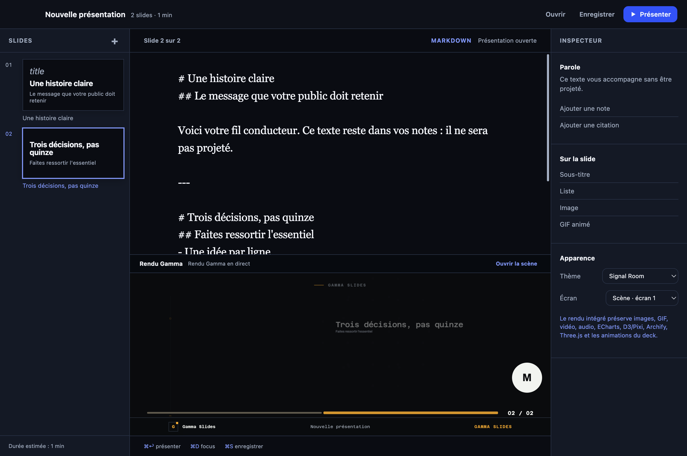

# Gamma Presenter for macOS

Gamma Presenter is the macOS desktop application for Gamma Slides. Its Author workspace follows the essential iA Presenter flow—write, shape, show, present—without copying its UI or assets. Only that working window opens at launch. It contains a faithful preview rendered by the Gamma engine; the public stage and speaker view remain explicit presentation actions.

The Writer and live-architecture captures were regenerated from the English-first packaged macOS app. The control-room capture below shows the approved local AI workflow. These images do not certify every media or animation path; the verification matrix below states the current coverage.



## Start in development

```bash
bun install
bun run desktop
```

Open a file directly:

```bash
bun run desktop -- ./my-presentation.md
```

Gamma YAML and JSON decks are also accepted. Source remains the durable format: the selected slide inspector exposes title, subtitle, notes, layout, and media—including local video/audio and privacy-enhanced YouTube embeds; **Full configuration** exposes that slide’s JSON object for charts, diagrams, GPU scenes, and animation. Changes pass Gamma validation before replacing the preview. A failed render keeps the last valid preview and reports the YAML line when available.

## Author a presentation

The **Author** workspace has three working areas: navigable thumbnails on the left, the document Writer and **Gamma Render** in the center, and the **Inspector** on the right. In Writer, Markdown is still the portable file format but its `#`, list, quote, and divider markers are not shown as syntax. Write the script normally; use **Show headline**, **Show supporting**, **Show point**, or **Show quote** only for audience copy. Press `⌘⇧↩`, choose **New slide**, or return three times to begin the next beat. **Markdown** is the one-click reversible expert view—nothing is converted or hidden from source control. The rail is a complete document workflow: create, duplicate, delete, move with buttons, or drag a thumbnail to reorder. These operations are source-aware and preserve unsupported Gamma properties such as charts, diagrams, 3D configuration, terminal blocks, and animations. **Import local media…** or dropping a file anywhere in Author copies an image, GIF, video, or audio file into a portable `media/` directory beside the saved deck and adds an editable slide. For YAML/JSON, the inspector edits common slide properties and locates the source fragment; full configuration remains the advanced escape hatch. The rail is virtualized for long decks. `⌘D` focuses writing by hiding the side panels; **Enlarge preview** switches to render review.

**Templates** opens a built-in, offline gallery before you write. It includes a blank story, a Markdown decision narrative, an Analyst Proof board update with a chart and table, a runnable Archify architecture review, and a Cutting Room live-operator rehearsal with the MCP approval model. Select one to replace the current unsaved document after a confirmation; the chosen deck immediately renders in Author and is ready for **Present**. Templates are source files held inside the packaged application, so they work without a network connection and can be saved, edited, and exported like any other deck.

Every change has an explicit state: local change, rendering, up to date, or error. An unsaved draft is recovered locally after restart. Saving clears that recovery draft and makes the file the sole source of truth. **History** retains the most recent 40 local source revisions; restoring an entry first records the current draft, so a last-minute correction is reversible.

### Connect & share

**Connect & share** opens with a local status check only. It does not start account consent, backup, restore, or publishing. For Google Drive, first import an operator-owned Desktop OAuth JSON with an `installed` client, then choose **Connect Google Drive** to begin explicit browser consent. Google Drive backups contain source only—Markdown, YAML, or JSON, including speaker notes—and exclude local media assets, recordings, credentials, and arbitrary files. **Browse backups** lists only Gamma Presenter-tagged source backups. **Open as draft** makes the selected backup an unsaved draft; the current source is preserved as a recoverable local revision before replacement.

GitHub Pages and Vercel use their installed CLIs, not an in-app provider OAuth form. Run `gh auth login` before publishing to an existing Gamma Pages repository. For Vercel, run `vercel login` and `vercel link`, then select the linked directory. Both publishing actions require confirmation that public output includes speaker notes. GitHub Pages publishes a generated rich YAML/JSON deck while the original local Markdown remains editable. Vercel stages only the rendered `index.html`, never the selected project files. A submitted remote deployment and a verified public URL are reported separately.

For any public HTTPS URL, **Copy link**, **Copy iframe**, **Copy Notion instructions**, and **Copy Linear link** generate text locally. They do not verify publication or the destination workspace’s embedding policy.

For recurring identity, **Appearance → Corporate profile** provides a local form for company metadata, a theme, logo/watermark, palette, and fonts. Applying it changes deck-level YAML/JSON only—slide content and per-slide overrides remain intact. An opt-in checkbox can apply the profile automatically when a new rich built-in template is selected; opening an existing deck never changes its brand silently.

Markdown separates what is projected from what is said. You normally use Writer, not this syntax; the source example documents the portable representation shown by **Markdown**:

```md
# A simple decision
## The message visible to the audience
- One piece of evidence
- One consequence

This sentence is a note: it stays in speaker view.

---

# The next chapter
```

- `#` starts a new moment / slide.
- `##` and lists are projected.
- Body text becomes a teleprompter note.
- `---` or three blank lines separate slides.
- `` accepts a local image, HTTPS URL, or data URI; `` preserves GIF animation.
- `@[video: Caption](media/demo.mp4)` and `@[audio: Caption](media/voice.m4a)` create local video and audio slides in Markdown. The Import command writes this syntax for you.
- A block quote (`> “Clarity beats volume.” — Author`) becomes a quote slide. A two-column Markdown table becomes a comparison; wider tables become a readable data table. These are automatic, deterministic layout choices rather than a hidden conversion step.
- YAML and JSON are the full editing route for Gamma layouts: visuals and illustrations, media, dashboards, charts, Archify, D3/Pixi, Three.js, and their animations.

## Run the native control room


Gamma Presenter is also a native macOS presentation controller. The app carries the Gamma Presenter name and icon in the Dock; while a deck is live, its menu-bar controller shows the elapsed deck time and gives immediate access to show/hide the app, Stage, Speaker View, next/previous slide, and the countdown. The Dock menu exposes the same essential controls. These controls are local to the open app and do not require an internet connection.

The **Control room** section in Author shows the deck timer and per-slide timer, lets the operator set/start/pause/clear a countdown, and sends a private speaker cue. A running countdown is visible in Speaker View; expiry becomes an unmissable red `TIME UP` state and produces a macOS notification. Normal and urgent cues stay in Author and Speaker View; they are never added to, or overlaid on, the public Stage.

### Let an LLM co-pilot the live deck

At startup, Gamma Presenter creates a **local MCP Streamable HTTP endpoint** on `127.0.0.1` and displays its endpoint plus an ephemeral bearer token in Author. Use **Copy connection** to paste a complete connection object into a compatible local MCP client. The endpoint accepts only loopback connections and the exact token; it stops when the app quits and is never advertised on the LAN.

The MCP tools are intentionally presentation-scoped: inspect status, start/stop Stage, open Speaker View, navigate, manage a countdown, and set/clear speaker cues. It also supports a structured **live action request** for Presenter Studio, Stage Console, browser demonstration, clean output, camera, microphone, screen sharing, recording, or an operator-approved spoken co-pilot note. Requests appear in **Live action approvals** and require the local operator to choose **Approve & run** or **Reject**; an LLM can never activate capture hardware, a recording, browser, shell, or speech silently. It has no tool for arbitrary shell execution, deck-file writes, deployment, or system access.

The adjacent **Local AI co-pilot** panel detects `codex` and `claude` on your `PATH`. It sends an explicit instruction to one installed CLI in the presentation folder and keeps the response in the app. Codex runs with its `read-only` sandbox; Claude Code runs in `plan` permission mode. It is a deliberate operator action, shows its output and status, has a 120-second/1 MB bound, and never becomes callable from the desktop MCP endpoint.

## Present and export

- **Present** (or `⌘↩`) opens the public **Stage** window only when requested. The **Stage · display** selector chooses the output display; the Presentation menu also exposes it. **Speaker View** opens separately from the Presentation menu, `⌘⇧↩`, or `S` on stage.
- **Speaker View** shows the projected preview, note/teleprompter, elapsed deck and slide clocks, countdown and private co-pilot cues, plus previous/next controls. **Notes** and **Slides** switch between reading and the complete slide grid. Rail cards jump to a passage. `S` from stage opens this view; arrow keys drive slides.
- The theme selector uses Gamma themes. The Stage preserves Presenter Studio for camera, microphone, screen capture, and local recording. macOS permission is available only to the active `gamma://` Stage after the operator asks for a device or recording source; the Author and Speaker windows cannot request it.
- The Stage Studio Console is available in the desktop app. It runs an explicitly entered command in the presentation folder, returns stdout/stderr to the operator, has a 30-second timeout and a 1 MB output limit, and is accessible only from the active Stage process. Static/shared presentations never gain this local-shell bridge.
- **Browser demonstration** opens an isolated Stage tool rather than navigating the presenter away from the deck. Its title bar can be dragged, its corner resized, and its geometry is restored locally; keyboard activation or double-clicking the title bar resets it. On macOS, Gamma never chooses the user’s Chrome automatically: an operator must configure `GAMMA_BROWSER_EXECUTABLE` (or `PUPPETEER_EXECUTABLE_PATH`) to a dedicated compatible Chromium before the isolated browser can launch.
- A YAML/JSON deck theme is written into source, so it remains after reopening.
- Stage and speaker view navigate the loaded renderer through a local message instead of reloading an iframe for every slide. Space in speaker view never steals focus from a button, input, or focused control.
- PNG/PDF export waits for renderer readiness, fonts, images, video metadata, and three composited frames. An animation or GIF exports as the frame visible at capture time; it is not a video export.
- File menu export supports source Markdown, PDF, standalone HTML, PowerPoint, a PNG sequence, and speaker handouts as HTML or PDF. The PowerPoint export carries titles, text, lists, quotes, comparisons, tables, local still images, and speaker notes. Charts, diagrams, 3D, video, and animations remain honestly identified as Gamma runtime scenes: use standalone HTML/Stage for their interactive form. Handouts are print-ready local documents that carry stage copy, tables, media references, and speaker notes; interactive/animated visuals remain described semantically rather than being flattened into a misleading still.

## Build the macOS application

For an Apple-silicon Mac, download the [current Gamma Presenter ZIP](https://github.com/hbfs-cloud/gamma-slides/releases/download/v2.0.3/Gamma.Presenter-2.0.3-arm64-mac.zip). The versioned link resolves to the matching GitHub Release and contains the `.app`; the package is unsigned until a Developer ID identity is supplied. The live demos and source can advance independently while the next desktop package is being validated.

```bash
bun run desktop:package
```

After packaging, exercise the actual arm64 application with the packaged smoke. The rebuilt v2.0.4 package smoke passed with exit 0: Writer height, **Show headline**, reversible Markdown, connection status and error recovery, a stable built-in live Archify template, three distinct theme fonts/backgrounds, authenticated MCP approval, stop → Author → add slide → Present, and private-cue visibility in Speaker View with no cue on public Stage. The concurrent Stage-load race found in a prior repeat is covered by four focused loader tests and this rebuilt-package smoke:

```bash
GAMMA_DESKTOP_APP="dist/mac-arm64/Gamma Presenter.app" bun run desktop:smoke
```

Packaging creates a DMG and ZIP in `dist/`; current-package DMG verification and ZIP integrity checks completed successfully. Apple signing and notarization are intentionally not configured in the repository: they require an Apple Developer account and signing credentials supplied by the product owner.

## Functional coverage

The desktop application supports Markdown import/writing, direct YAML/JSON editing, direct slide create/duplicate/delete/reorder, portable local images/GIFs/video/audio, themes, embedded responsive Gamma rendering, rich Gamma decks, selected-display stage, Speaker View, a native menu-bar/Dock controller, local authenticated MCP co-piloting with operator-approved live actions, local Codex/Claude planning responses, local Stage Console, local camera/microphone/recording controls, navigation, PDF/HTML/PNG export, speaker handouts as HTML/PDF, local revision recovery, source-only Google Drive backup and draft restore, corporate profiles, GitHub Pages/Vercel actions through authenticated CLIs, and portable public iframe/Notion/Linear share copy.

## What distinguishes Gamma Presenter

Gamma Presenter does not attempt to replace every slide tool. It sits at the intersection of a focused macOS editor and a rich declarative runtime.

| Tool | Primary model | Gamma distinction |
| --- | --- | --- |
| iA Presenter | Writing and staging in a macOS application | Gamma follows source → preview → stage, then adds portable YAML/JSON decks and the Gamma visualization runtime. |
| reveal.js | Web presentation framework with API, notes, and PDF export | Gamma uses Reveal for navigation, then layers on a deck schema, validation, embedded assets, layouts, themes, export, and a macOS control room. [Reveal docs](https://revealjs.com/) |
| Marp | Markdown ecosystem with HTML/PDF/PPTX/image conversion | Gamma keeps Markdown for rapid writing, while rich scenes use structured YAML/JSON for media, diagrams, and interactive visualization. [Marp docs](https://marp.app/) |
| Slidev | Developer presentations in Markdown/Vue, built with Vite | Gamma prioritizes a deck format and self-contained renderer rather than an extensible Vue component application. That is a reproducibility/control-room choice, not a claim to replace Slidev’s component ecosystem. |

## Capability and verification matrix

| Capability | Authoring | Presenter render | Current evidence |
| --- | --- | --- | --- |
| Markdown, notes, slide rail | Markdown + create/duplicate/delete/drag reorder | Yes | 144-test unit/integration pass plus rebuilt-package Writer-height/Show/reversible-Markdown smoke |
| YAML/JSON, themes, rich slides | Source + inspector + JSON configuration | Yes | Unit/browser contracts, including the final 15/15 immersive/connections/gallery regression, targeted visual checks, and rebuilt-package smoke across three distinct themes |
| Images, GIFs, video, audio | Inspector import copies into `media/`; Markdown and rich source | Yes in runtime | Unit tests for Markdown/rich insertion; dedicated Electron playback validation remains to be completed |
| ECharts | YAML/JSON, full slide configuration | Yes | HTML renderer test + chart capture |
| Archify, D3, Pixi, Three.js, animation | YAML/JSON, full slide configuration | Yes through Gamma runtime | Rebuilt-package stable live Archify smoke passed; mobile immersive check passed after the axis-overlap fix; D3/Pixi/Three/animation still need their own interactive native coverage |
| Terminal / camera / recording | Active Stage Studio only | Yes, with explicit operator action | Terminal PTY tests; desktop bridge is source/window scoped; macOS capture smoke remains to be completed |
| MCP co-pilot / countdown / cues / live requests | Local Author control room | Yes, operator-only private surfaces; capture/recording/shell-adjacent actions require an explicit approval | Token/loopback unit tests plus rebuilt-package authenticated approval smoke; private cue verified in Speaker and absent from public Stage |
| PNG / PDF / HTML / PowerPoint / handout | File menu | Yes | Slide export waits for readiness; PowerPoint and handouts preserve notes and semantic slide content locally |

This matrix is not exhaustive certification. Writer preview-height and mobile 3D-axis overlap fixes passed targeted checks and inspected screenshots, and the rebuilt-package smoke passed after the Stage-load race fix. Local media playback, D3/Pixi/Three/animation, capture hardware, and physical-device coverage remain separate gates before a signed distribution release.
